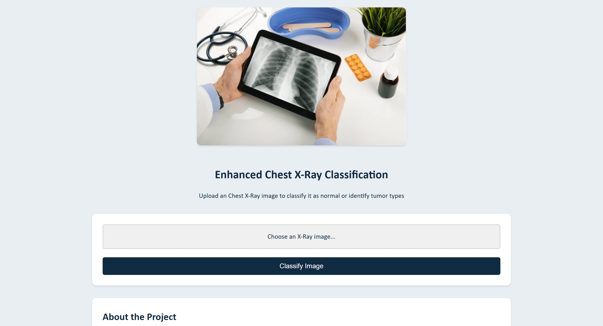

# Chest X-Ray Classification AI

  
*Example of the model classifying a COVID-19 X-ray*

A deep learning model to classify chest X-rays into **COVID-19, Pneumonia, Tuberculosis, or Normal**. Designed to assist (not replace) medical professionals.

## Key Features
✔️ **Four-Class Detection**:  
- `COVID-19`: Ground-glass opacities  
- `Pneumonia`: Lobar consolidations  
- `Tuberculosis`: Cavitary lesions  
- `Normal`: No abnormalities  

✔️ **DICOM & JPEG Support**  
✔️ **Batch Processing**  
✔️ **REST API Integration**

## Dataset
| Class         | Image Count 
|---------------|------------|
| Normal        | 5,200      |
| Pneumonia     | 4,300      | 
| COVID-19      | 3,150      | 
| Tuberculosis  | 2,700      | 

